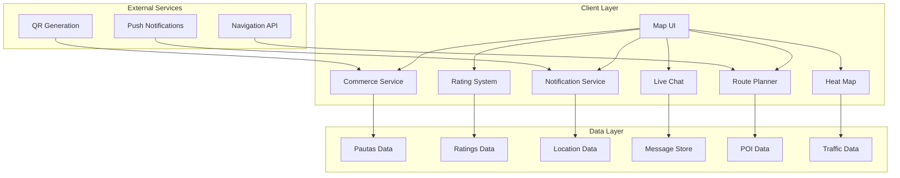

# Design Document: Tourist-Commerce Experience Improvements

## Overview

This document outlines the technical design for enhancing the connection between tourists and commercial services in the Armenia 2026 Map. The improvements transform the map from a simple directory into an interactive, personalized tourism companion that helps visitors discover, engage with, and benefit from local commerce while exploring Armenia, Quindío.

The 10 improvements focus on making commercial information more accessible, actionable, and valuable to tourists, while providing businesses with better tools to connect with potential customers.

### Design Principles

1. **Backward Compatibility**: All new features must work with existing data structures and not break current functionality
2. **Progressive Enhancement**: Core features should work without enhancements (e.g., basic commerce info without ratings)
3. **Performance First**: All new features must maintain current app performance standards (under 2-second load times)
4. **Privacy by Default**: User data must be handled with appropriate privacy controls
5. **Offline Support**: Core features should work offline where possible with local caching

---

## Architecture

### System Components



### Data Flow

1. **Commerce Data Flow**: Pautas data → Commerce Service → UI Components
2. **Rating Flow**: User input → Rating Service → Ratings Data → UI Display
3. **Notification Flow**: Location updates → Proximity Check → Notification Service → Push Notification
4. **Chat Flow**: User message → Message Service → Commerce System → Delivery Confirmation
5. **Route Flow**: User selection → Route Optimizer → Navigation API → Turn-by-turn Instructions
6. **Heat Map Flow**: Traffic data → Aggregation → Visualization Layer → Map Overlay

---

## Components and Interfaces

### 1. Enhanced Pauta Ficha Component

#### Component Structure

```javascript
// New UI Component: ServiceIcons
class ServiceIcons {
  constructor(serviceList, serviceIconsMap) {
    this.serviceList = serviceList;
    this.serviceIconsMap = serviceIconsMap;
  }
  
  render() {
    // Render service icons with tooltips
    // Include accessibility attributes
  }
  
  getIconForService(serviceName) {
    // Return appropriate icon or generic icon
  }
}
```

#### Integration Points

- **Pauta Ficha Modal**: Add service icons section in the services list
- **Pauta Card**: Show key service icons in compact view
- **Search Results**: Show service icons in commerce listings

#### UI Mockup

```
┌─────────────────────────────────────┐
│  [Service Icons Section]            │
│  ☕  🍽️  🪑  👥  🏠                  │
│  Café  Rest.  Cowork.  Inclus.  Fam.│
└─────────────────────────────────────┘
```

### 2. Service Type Sub-filters Component

#### Component Structure

```javascript
// New UI Component: ServiceTypeFilters
class ServiceTypeFilters {
  constructor(commerceCategories) {
    this.categories = commerceCategories;
    this.selectedTypes = new Set();
  }
  
  render() {
    // Render sub-filter options
  }
  
  filterCommerces(commerces) {
    // Filter commerces by selected service types
  }
}
```

#### Filter Categories

- **Restaurants**: Full-service dining establishments
- **Cafes**: Coffee shops and casual dining
- **Hotels**: Accommodation providers
- **Shopping**: Retail stores and boutiques
- **Services**: Professional services (insurance, legal, etc.)
- **Entertainment**: Venues for leisure and entertainment

### 3. Reviews and Ratings Component

#### Data Interface

```typescript
interface Rating {
  commerceId: string;
  userId: string; // Anonymous hash
  rating: 1 | 2 | 3 | 4 | 5;
  review?: string;
  timestamp: string; // ISO 8601
}

interface CommerceRatingSummary {
  commerceId: string;
  averageRating: number;
  reviewCount: number;
  ratingDistribution: {
    1: number;
    2: number;
    3: number;
    4: number;
    5: number;
  };
}
```

#### Component Structure

```javascript
// New UI Component: RatingsDisplay
class RatingsDisplay {
  constructor(ratingSummary) {
    this.summary = ratingSummary;
  }
  
  render() {
    // Render star rating and review count
  }
  
  renderInput() {
    // Render rating input for users
  }
}
```

### 4. Special Offers Component

#### Data Interface

```typescript
interface SpecialOffer {
  id: string;
  commerceId: string;
  title: string;
  description: string;
  discount?: number; // Percentage or amount
  offerType: 'percentage' | 'amount' | 'freebie';
  validFrom: string; // ISO 8601
  validTo: string; // ISO 8601
  terms?: string;
  isActive: boolean;
}
```

#### Component Structure

```javascript
// New UI Component: SpecialOfferBadge
class SpecialOfferBadge {
  constructor(offer) {
    this.offer = offer;
  }
  
  render() {
    // Render prominent badge with offer details
  }
  
  isOfferActive() {
    // Check if offer is currently valid
  }
}
```

### 5. Route Optimization Component

#### Data Interface

```typescript
interface RouteStop {
  poiId: string;
  pautaId?: string;
  order: number;
  estimatedTime: number; // minutes
  estimatedDistance: number; // meters
}

interface RouteOption {
  id: string;
  stops: RouteStop[];
  totalDistance: number; // meters
  totalDuration: number; // minutes
  commercialStops: number;
  optimizationScore: number;
}
```

#### Component Structure

```javascript
// New Service: RouteOptimizer
class RouteOptimizer {
  constructor(pois, pautas) {
    this.pois = pois;
    this.pautas = pautas;
  }
  
  optimizeRoute(selectedPois, preferences) {
    // Optimize route based on proximity, category relevance, preferences
  }
  
  calculateSegmentMetrics(stops) {
    // Calculate time and distance for each segment
  }
}
```

### 6. Push Notification Component

#### Data Interface

```typescript
interface NotificationPreference {
  userId: string;
  distanceThreshold: number; // meters
  categoriesOfInterest: string[];
  enabled: boolean;
}

interface CommerceProximity {
  commerceId: string;
  distance: number; // meters
  matchScore: number;
}
```

#### Component Structure

```javascript
// New Service: NotificationService
class NotificationService {
  constructor() {
    this.preferences = null;
    this.lastProximityCheck = null;
  }
  
  async checkProximity(currentLocation) {
    // Check proximity to commercial establishments
  }
  
  async sendNotification(commerce, distance) {
    // Send push notification
  }
}
```

### 7. QR Code Component

#### Component Structure

```javascript
// New Service: QRCodeGenerator
class QRCodeGenerator {
  constructor() {
    this.qrLibrary = null; // e.g., qrcode.js
  }
  
  generateForCommerce(commerceId, baseUrl) {
    // Generate QR code for commerce
  }
  
  renderQRCode(element, commerceId, baseUrl) {
    // Render QR code to DOM element
  }
}
```

### 8. Live Chat Component

#### Data Interface

```typescript
interface ChatMessage {
  id: string;
  commerceId: string;
  userId: string;
  content: string;
  timestamp: string;
  isFromCommerce: boolean;
  status: 'sent' | 'delivered' | 'read';
}

interface ChatSession {
  sessionId: string;
  commerceId: string;
  userId: string;
  messages: ChatMessage[];
  lastMessage: string;
  lastMessageTime: string;
}
```

#### Component Structure

```javascript
// New UI Component: LiveChat
class LiveChat {
  constructor(commerceId) {
    this.commerceId = commerceId;
    this.messages = [];
  }
  
  async connect() {
    // Establish connection to commerce messaging system
  }
  
  async sendMessage(content) {
    // Send message and get delivery confirmation
  }
  
  render() {
    // Render chat interface
  }
}
```

### 9. Open/Closed Status Component

#### Data Interface

```typescript
interface OperatingHours {
  monday?: TimeRange;
  tuesday?: TimeRange;
  wednesday?: TimeRange;
  thursday?: TimeRange;
  friday?: TimeRange;
  saturday?: TimeRange;
  sunday?: TimeRange;
  holidays?: TimeRange[];
}

interface TimeRange {
  start: string; // HH:mm format
  end: string; // HH:mm format
}

interface CommerceStatus {
  isOpen: boolean;
  nextOpening?: string; // ISO 8601
  nextClosing?: string; // ISO 8601
  statusText: string;
}
```

#### Component Structure

```javascript
// New Service: StatusCalculator
class StatusCalculator {
  constructor() {
    this.currentDate = new Date();
  }
  
  calculateStatus(hours, date = this.currentDate) {
    // Calculate open/closed status based on hours
  }
  
  getNextOpening(hours, date = this.currentDate) {
    // Calculate next opening time
  }
}
```

### 10. Heat Map Component

#### Data Interface

```typescript
interface TrafficPoint {
  lat: number;
  lng: number;
  timestamp: string;
  poiId?: string;
  pautaId?: string;
}

interface TrafficAggregation {
  lat: number;
  lng: number;
  density: number; // 0-100 scale
  period: string; // 'hour' | 'day' | 'week'
}
```

#### Component Structure

```javascript
// New UI Component: HeatMapLayer
class HeatMapLayer {
  constructor(map) {
    this.map = map;
    this.heatMapLayer = null;
  }
  
  async loadTrafficData(period) {
    // Load traffic data for specified period
  }
  
  render(trafficData) {
    // Render heat map layer on map
  }
  
  showLegend() {
    // Show color scale legend
  }
}
```

---

## Data Models

### Extended Pautas Data Structure

```json
{
  "id": "string",
  "nombre": "string",
  "categoria": "string",
  "imagen": "string",
  "poiId": "string",
  "slogan": "string",
  "direccion": "string",
  "telefono": "string",
  "whatsapp": "string",
  "whatsappMensaje": "string",
  "horario": "string",
  "serviceTypes": ["string"], // NEW: Service types for filtering
  "specialOffer": { // NEW: Special offer details
    "title": "string",
    "description": "string",
    "discount": "number",
    "validFrom": "string",
    "validTo": "string"
  },
  "operatingHours": { // NEW: Structured operating hours
    "monday": {"start": "12:00", "end": "20:00"},
    "tuesday": {"start": "12:00", "end": "20:00"},
    "wednesday": {"start": "12:00", "end": "20:00"},
    "thursday": {"start": "12:00", "end": "20:00"},
    "friday": {"start": "12:00", "end": "20:00"},
    "saturday": {"start": "12:00", "end": "20:00"},
    "sunday": null
  },
  "ficha": {
    "destacado": "string",
    "descripcion": "string",
    "servicios": ["string"]
  }
}
```

### New Ratings Data Structure

```json
{
  "ratings": [
    {
      "commerceId": "string",
      "userId": "string",
      "rating": 1,
      "review": "string",
      "timestamp": "ISO 8601 string"
    }
  ]
}
```

### New Special Offers Data Structure

```json
{
  "specialOffers": [
    {
      "id": "string",
      "commerceId": "string",
      "title": "string",
      "description": "string",
      "discount": 10,
      "validFrom": "ISO 8601 string",
      "validTo": "ISO 8601 string",
      "terms": "string"
    }
  ]
}
```

### New Traffic Data Structure

```json
{
  "trafficPoints": [
    {
      "id": "string",
      "lat": 4.5339,
      "lng": -75.6811,
      "timestamp": "ISO 8601 string",
      "poiId": "string",
      "pautaId": "string"
    }
  ]
}
```

---

## UI/UX Design

### Enhanced Pauta Ficha

#### Before
```
┌─────────────────────────────────────┐
│  [Pauta Ficha]                      │
│  Services:                          │
│  - Café y chocolate de autor        │
│  - Restaurante                      │
│  - Espacio coworking                │
└─────────────────────────────────────┘
```

#### After
```
┌─────────────────────────────────────┐
│  [Pauta Ficha]                      │
│  Services:                          │
│  ☕ Café y chocolate de autor       │
│  🍽️ Restaurante                     │
│  🪑 Espacio coworking               │
└─────────────────────────────────────┘
```

### Service Type Sub-filters

#### UI Flow
1. User selects "Comercial" category
2. Sub-filters appear: Restaurants, Cafes, Hotels, Shopping, Services, Entertainment
3. User selects one or more sub-filters
4. Map updates to show only matching commercial establishments

### Reviews and Ratings

#### UI Elements
- **Star Rating Display**: 5-star visual with average rating
- **Review Count**: Number of reviews displayed alongside rating
- **Rating Input**: Star selector for users to rate businesses
- **Review Text**: Optional text field for written reviews

### Special Offers

#### UI Elements
- **Badge**: Prominent "OFERTA ESPECIAL" badge on Pauta Ficha
- **Banner**: Highlighted section showing offer details
- **Search Highlight**: Special offer indicator in search results

### Route Optimization

#### UI Elements
- **Route Options**: Multiple route suggestions with commercial stops
- **Segment Details**: Time and distance for each segment
- **Customization**: Drag-and-drop reorder for stops

### Push Notifications

#### UI Elements
- **Settings Panel**: Configure notification preferences
- **Notification Card**: Display incoming notifications
- **Action Buttons**: View details, dismiss, navigate

### QR Codes

#### UI Elements
- **QR Display**: High-contrast QR code on Pauta Ficha
- **Context Information**: Commerce name and description below QR
- **Scanning Instructions**: Simple instructions for users

### Live Chat

#### UI Elements
- **Chat Window**: Full-screen or modal chat interface
- **Message History**: Scrollable message list
- **Status Indicators**: Sent, delivered, read indicators
- **Alternative Contact**: Email/phone fallback

### Open/Closed Status

#### UI Elements
- **Status Badge**: "ABIERTO" (green) or "CERRADO" (red)
- **Next Opening**: "Siguiente apertura: 9:00 AM"
- **Visual Indicator**: Color-coded status icon

### Heat Map

#### UI Elements
- **Toggle Switch**: Enable/disable heat map layer
- **Legend**: Color scale explanation
- **Time Selector**: Dropdown for time period selection
- **Traffic Density**: Color-coded areas on map

---

## Technical Implementation Approach

### Phase 1: Core Enhancements (High Priority)

#### Week 1-2: Enhanced Pauta Ficha
- Implement service icons component
- Add service type filtering
- Implement open/closed status calculation

#### Week 3-4: QR Codes and Notifications
- Implement QR code generation
- Set up push notification infrastructure
- Implement proximity checking

### Phase 2: Engagement Features (Medium Priority)

#### Week 5-6: Reviews and Ratings
- Implement rating storage and retrieval
- Add rating UI components
- Calculate and display average ratings

#### Week 7-8: Special Offers
- Implement special offer data structure
- Add special offer UI components
- Implement offer validation logic

### Phase 3: Advanced Features (Lower Priority)

#### Week 9-10: Live Chat
- Implement chat infrastructure
- Add chat UI components
- Set up message storage

#### Week 11-12: Route Optimization and Heat Map
- Implement route optimization algorithm
- Add route UI components
- Implement heat map visualization

### Implementation Guidelines

1. **Use Existing Patterns**: Follow existing code patterns in `js/map.js`
2. **Modular Design**: Create separate modules for each feature
3. **Backward Compatibility**: Ensure existing functionality works unchanged
4. **Performance Testing**: Test each feature for performance impact
5. **Accessibility**: Follow WCAG 2.1 guidelines for all UI components

---

## Correctness Properties

*A property is a characteristic or behavior that should hold true across all valid executions of a system-essentially, a formal statement about what the system should do. Properties serve as the bridge between human-readable specifications and machine-verifiable correctness guarantees.*

### Property 1: Service Icons Display Consistency

*For any* Pauta Ficha with services, each service in the "Servicios" section SHALL be displayed with an appropriate icon, and hovering over the icon SHALL display a tooltip with the service name.

**Validates: Requirements 1.1, 1.2, 1.4**

### Property 2: Service Icon Accessibility

*For any* service icon displayed in the Pauta Ficha, the icon SHALL have appropriate alt text that matches the service name, ensuring screen reader compatibility.

**Validates: Requirements 1.5**

### Property 3: Generic Icon Fallback

*For any* service that does not have a specific icon defined, the system SHALL display a generic service icon instead of omitting the icon.

**Validates: Requirements 1.3**

### Property 4: Service Type Filter Availability

*For any* commercial category selection, the system SHALL display sub-filter options for service types (Restaurants, Cafes, Hotels, Shopping, Services, Entertainment).

**Validates: Requirements 2.1, 2.2**

### Property 5: Filter Combination Logic

*For any* combination of category filters and service type sub-filters, the system SHALL display only commercial establishments that match all selected filters.

**Validates: Requirements 2.3, 2.5, 2.6**

### Property 6: Empty State Handling

*For any* filter selection that results in no matching commercial establishments, the system SHALL display a message indicating no results were found.

**Validates: Requirements 2.4**

### Property 7: Rating Display Accuracy

*For any* Pauta Ficha with ratings, the system SHALL display the correct average rating (1-5 stars) and the accurate number of reviews.

**Validates: Requirements 3.1, 3.2**

### Property 8: Rating Storage Anonymity

*For any* rating submitted by a user, the system SHALL store it anonymously with only the commerce ID, without associating it with any personally identifiable information.

**Validates: Requirements 3.5**

### Property 9: Special Offer Validation

*For any* special offer, the system SHALL verify it is currently valid (within the validFrom and validTo dates) before displaying it to users.

**Validates: Requirements 4.5**

### Property 10: Special Offer Highlighting

*For any* commerce with an active special offer, the system SHALL highlight it in search results and category listings with a prominent indicator.

**Validates: Requirements 4.3**

### Property 11: Route Optimization Accuracy

*For any* set of selected points of interest, the route optimization algorithm SHALL calculate routes that include commercial stops and order them based on proximity, category relevance, and user preferences.

**Validates: Requirements 5.1, 5.2**

### Property 12: Route Segment Metrics

*For any* route option that includes commercial stops, the system SHALL display accurate estimated time and distance for each segment.

**Validates: Requirements 5.3**

### Property 13: Route Customization

*For any* suggested route, the system SHALL allow users to customize the order of stops while maintaining route validity.

**Validates: Requirements 5.4**

### Property 14: Proximity Notification Trigger

*For any* user within the configured distance threshold of a commerce matching their interests, the system SHALL send a push notification with the commerce details.

**Validates: Requirements 6.2**

### Property 15: Notification Content Completeness

*For any* push notification sent by the system, the notification SHALL include the commerce name, category, and a brief description.

**Validates: Requirements 6.4**

### Property 16: QR Code Encoding Accuracy

*For any* QR code generated for a commerce, the QR code SHALL encode a URL that directly links to the commerce's information page.

**Validates: Requirements 7.2**

### Property 17: QR Code Scanning Behavior

*For any* QR code scan event, the system SHALL open the commerce's information page in the app or browser.

**Validates: Requirements 7.3**

### Property 18: Live Chat Connection

*For any* user opening the live chat feature, the system SHALL establish a connection to the commerce's messaging system and display the chat interface.

**Validates: Requirements 8.1, 8.2**

### Property 19: Message Delivery Confirmation

*For any* message sent through the live chat feature, the system SHALL provide delivery confirmation and status indicators.

**Validates: Requirements 8.5**

### Property 20: Open/Closed Status Accuracy

*For any* commerce, the system SHALL calculate and display the correct open/closed status based on the current time and the commerce's operating hours.

**Validates: Requirements 9.1, 9.2**

### Property 21: Status Display for Missing Hours

*For any* commerce without available operating hours, the system SHALL display "Hours not specified" instead of attempting to guess the status.

**Validates: Requirements 9.3**

### Property 22: Next Opening Time Display

*For any* commerce that is currently closed, the system SHALL display the next opening time if available.

**Validates: Requirements 9.4**

### Property 23: Heat Map Data Requirements

*For any* heat map visualization, the system SHALL have sufficient traffic data to render a meaningful visual representation, and SHALL display a message indicating limited data coverage when data is insufficient.

**Validates: Requirements 10.3**

### Property 24: Heat Map Legend Availability

*For any* heat map layer displayed on the map, the system SHALL provide a legend explaining the color scale.

**Validates: Requirements 10.4**

### Property 25: Time Period Selection

*For any* heat map visualization, the system SHALL allow users to select different time periods (current hour, today, this week) for viewing traffic data.

**Validates: Requirements 10.5**

---

## Error Handling

### Common Error Scenarios

1. **Data Loading Failures**
   - Handle missing or corrupted data files gracefully
   - Display user-friendly error messages
   - Provide retry mechanisms

2. **Service Icon Missing**
   - Fallback to generic icon when specific icon unavailable
   - Log missing icon mappings for future enhancement

3. **Rating Calculation Errors**
   - Handle division by zero when no ratings exist
   - Validate rating values before calculation

4. **QR Code Generation Failures**
   - Provide alternative QR code generation method
   - Display error message if generation consistently fails

5. **Location Services Unavailable**
   - Gracefully degrade notification functionality
   - Provide clear instructions for enabling location

6. **Chat Connection Failures**
   - Provide alternative contact methods
   - Store messages locally for later delivery

7. **Heat Map Data Insufficient**
   - Display appropriate message about limited data
   - Prevent layer activation when no data available

### Error Handling Patterns

```javascript
// Example: Safe rating calculation
function calculateAverageRating(ratings) {
  if (!ratings || ratings.length === 0) {
    return null;
  }
  
  const sum = ratings.reduce((acc, r) => acc + r.rating, 0);
  return sum / ratings.length;
}

// Example: Graceful QR code generation
async function generateQRCodeSafe(commerceId, baseUrl) {
  try {
    return await generateQRCode(commerceId, baseUrl);
  } catch (error) {
    console.error('QR code generation failed:', error);
    return null;
  }
}
```

---

## Testing Strategy

### Dual Testing Approach

**Unit Tests**: Verify specific examples, edge cases, and error conditions
**Property Tests**: Verify universal properties across all inputs

### Property-Based Testing

Property-based tests will be implemented for all correctness properties identified in this design document. Each property will have a corresponding test that validates the property holds across many generated inputs.

**Test Configuration**:
- Minimum 100 iterations per property test
- Each test tagged with **Feature: tourist-commerce-improvements, Property {number}: {property_text}**
- Use fast-check library for property-based testing

### Unit Testing

Unit tests will focus on:
- Specific examples that demonstrate correct behavior
- Integration points between components
- Edge cases and error conditions

### Integration Testing

Integration tests will verify:
- End-to-end user flows
- Data persistence and retrieval
- External service interactions

### Test Coverage Targets

- **Property Tests**: 25 properties (one per correctness property)
- **Unit Tests**: 50+ test cases covering specific scenarios
- **Integration Tests**: 10+ end-to-end flows

### Testing Tools

- **fast-check**: Property-based testing
- **Jest**: Unit testing framework
- **Cypress**: Integration testing
- **ESLint**: Code quality
- **Prettier**: Code formatting

### Example Property Test

```javascript
const fc = require('fast-check');

describe('Property 1: Service Icons Display Consistency', () => {
  it('should display service icons with tooltips for all services', () => {
    fc.assert(
      fc.property(
        fc.record({
          services: fc.array(fc.string(), { minLength: 1 }),
          iconsMap: fc.dictionary(fc.string(), fc.string())
        }),
        ({ services, iconsMap }) => {
          const component = new ServiceIcons(services, iconsMap);
          const rendered = component.render();
          
          // Verify each service has an icon
          services.forEach(service => {
            expect(rendered).toContain(service);
            expect(rendered).toContain(getIconForService(service, iconsMap));
          });
          
          // Verify tooltips are present
          expect(rendered).toMatch(/aria-label="[^"]*"/g);
        }
      ),
      { numRuns: 100 }
    );
  });
});
```

---

## Integration with Existing Map Functionality

### Current Architecture

The existing map application uses:
- **Leaflet** for map rendering
- **Vanilla JavaScript** for logic
- **JSON data files** for content
- **CSS** for styling

### Integration Points

1. **Pautas Data Extension**
   - Extend existing `pautas.json` structure
   - Maintain backward compatibility with existing fields

2. **Map UI Components**
   - Add new UI components to existing modal system
   - Extend filter system for service types
   - Integrate new data displays

3. **Data Loading**
   - Load new data files alongside existing data
   - Merge data in memory for unified access

4. **Event Handling**
   - Extend existing event system for new features
   - Maintain consistent event naming conventions

### Migration Strategy

1. **Data Migration**: Extend existing data structures
2. **UI Migration**: Add new components alongside existing ones
3. **Testing**: Verify existing functionality unchanged
4. **Gradual Rollout**: Enable features incrementally

---

## Performance Considerations

### Load Time Optimization

- **Lazy Loading**: Load new features only when needed
- **Caching**: Cache data locally for offline access
- **Compression**: Compress data files where possible

### Runtime Performance

- **Debouncing**: Debounce search and filter operations
- **Virtualization**: Virtualize long lists
- **Optimization**: Optimize route calculation algorithm

### Memory Management

- **Cleanup**: Clean up event listeners and resources
- **Garbage Collection**: Avoid memory leaks
- **Pooling**: Reuse objects where possible

---

## Security Considerations

### Data Privacy

- **Anonymous Ratings**: Store ratings without user identification
- **Encrypted Storage**: Encrypt sensitive data
- **Access Control**: Implement appropriate access controls

### Input Validation

- **Sanitize User Input**: Prevent XSS attacks
- **Validate Data**: Validate all incoming data
- **Error Handling**: Handle errors gracefully

### API Security

- **HTTPS**: Use HTTPS for all external API calls
- **Authentication**: Implement authentication where needed
- **Rate Limiting**: Implement rate limiting for APIs

---

## Future Enhancements

1. **Payment Integration**: In-app purchases and payments
2. **Language Translation**: Multi-language support
3. **Audio Guides**: Audio guides and AR features
4. **Social Sharing**: Review posting and social sharing
5. **Business Analytics**: Analytics dashboard for commerce owners

---

## Implementation Checklist

- [ ] **Phase 1: Core Enhancements**
  - [ ] Enhanced Pauta Ficha with service icons
  - [ ] Service type sub-filters
  - [ ] Open/closed status calculation
  - [ ] QR code generation

- [ ] **Phase 2: Engagement Features**
  - [ ] Reviews and ratings system
  - [ ] Special offers/promotions
  - [ ] Push notifications

- [ ] **Phase 3: Advanced Features**
  - [ ] Live chat
  - [ ] Route optimization
  - [ ] Heat map visualization

- [ ] **Testing**
  - [ ] Property-based tests for all correctness properties
  - [ ] Unit tests for edge cases
  - [ ] Integration tests for end-to-end flows
  - [ ] Performance testing
  - [ ] Accessibility testing

- [ ] **Documentation**
  - [ ] API documentation
  - [ ] User documentation
  - [ ] Developer documentation
